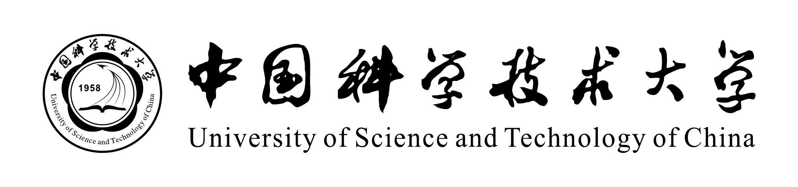

  

<h1 align="center">中国科学技术大学生存手册</h1>

<em>红专并进，理实交融</em>

---

由 USTC 校友与在校生共同编写的非官方生存指南。本手册在结构与精神上承袭 [上海交通大学生存手册](https://survivesjtu.gitbook.io/survivesjtumanual/) 与 [上海交通大学飞跃手册](https://github.com/SurviveSJTU/SJTU-Application)，将「生存」与「飞跃」合并为一卷。

## 本手册包含什么

- **立志篇**：如何看待大学、如何避免失败的思维方式、如何寻找自己真正想做的事
- **飞跃篇**：关于留学、科研、保研、考研、就业、落户等不同出路的学长学姐经验
- **生存技巧**：选课、绩点、转专业、备考等"校园潜规则"
- **附录**：各专业介绍、转专业/实习/科研/社团等经验汇编

## 如何阅读

- 在线版本：GitBook / GitHub Pages（TODO：待部署）
- 本地阅读：从 [SUMMARY.md](./SUMMARY.md) 进入任意章节

## 如何贡献

**本仓库目前处于"骨架搭建完成，等待内容填充"阶段。** 主要内容将由往届 USTC 飞跃手册 PDF 整理、拆分后填入对应章节。

- 有往届手册 PDF 要贡献？见 [贡献指南](./附录/贡献指南.md) 中的 **PDF 汇入流程**
- 想单独写一篇经验？fork 后直接改对应章节的 md 文件并提 PR
- 发现错误/过时信息？欢迎提 Issue 或 PR

## 许可协议

[CC BY-NC-SA 4.0](./LICENSE) — 允许非商业性转载与改编，须署名并采用相同协议。

## 免责声明

- 本手册为 **非官方** 资料，仅代表贡献者个人经验
- 涉及规章制度的，以 **学校官方最新文件** 为准
- 涉及时效性内容（政策、链接、价格）可能过时，欢迎 PR 更新

## 素材来源

`assets/` 目录下的 USTC 校徽 / 校标素材来自 [ustctug/ustclogo](https://github.com/ustctug/ustclogo)（USTC TeX User Group 维护的视觉识别素材包）。
